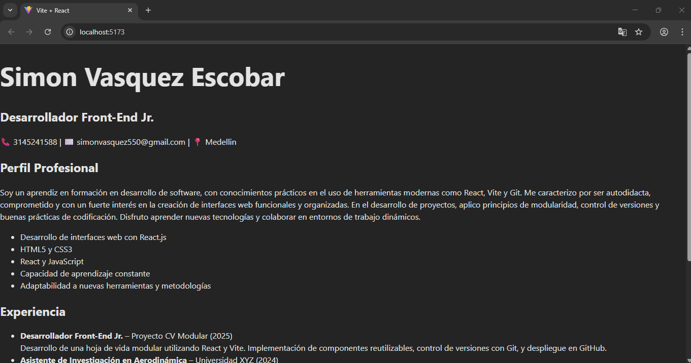

# CV Modular en React

Este proyecto consiste en una hoja de vida desarrollada con React y Vite.

## Captura de pantalla

## Instrucciones para ejecutar el proyecto

1. Clona el repositorio:
git clone https://github.com/Simonvasquez0811/cv-simon

2. Instala las dependencias:
npm install

3. Inicia el servidor:
npm run dev

4. Abre en tu navegador: [http://localhost:5173](http://localhost:5173)
